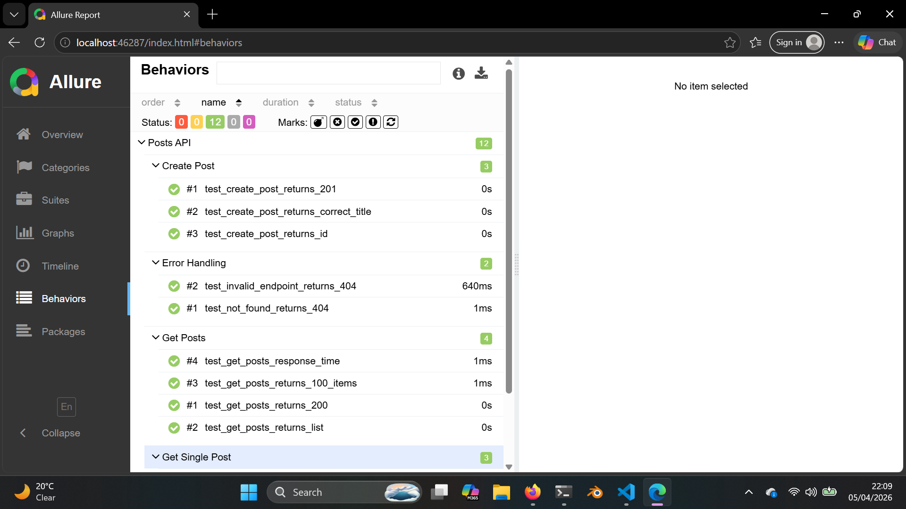

# Cloud QA Portfolio

Automated API test suite built with Pytest, GitHub Actions, and Allure reporting.

## Tech Stack
- Python + Pytest
- Requests
- GitHub Actions (CI/CD)
- Allure (Test Reporting)

## Test Coverage
- GET /posts — status, data type, item count, response time
- GET /posts/1 — required fields, correct ID, content type
- POST /posts — status 201, correct title, ID assigned
- Error handling — 404 for missing and invalid endpoints

## Test Results
12 tests | 100% passing | ~8 seconds

### Allure Report — Behaviors View


## How to Run

### Install dependencies
```bash
pip install -r requirements.txt
```

### Run tests
```bash
pytest tests/ -v
```

### Generate Allure report
```bash
pytest tests/ -v --alluredir=allure-results
allure generate allure-results --clean -o allure-report
allure open allure-report --host 0.0.0.0 --port 5050
```